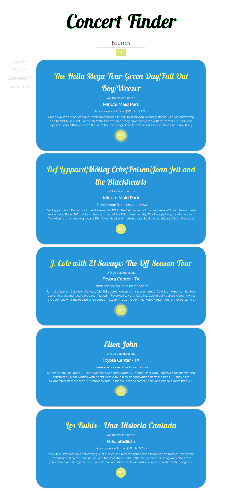

# Concert Finder

This was my first group project in University of Denver's full stack bootcamp. We were tasked with creating a mobile-friendly application using two separate API calls. We chose to create an application that allows you to search for a city and it will return concerts in that area. Along with the concerts that will be playing in that city, it will also share information about that artist on the same page.

## How it Works

1. Search for a city that you may be planning on visiting or one that you would like to visit.
2. Hit the SEARCH button and receive results of concerts playing in that city.
3. Along with the bands that will be playing there, you will see the venue, price ranges, and information regarding that particular artist.
4. If you are interested in purchasing a ticket, simply click the BUY button and it will redirect you to TicketMaster where you are then able to purchase those tickets.

## Technologies Used

* HTML
* CSS
* JavaScript
* jQuery
* Ajax

## Contributors

* https://github.com/baystaub
* https://github.com/markraud
* https://github.com/ziffoit
* https://github.com/micahshu

## Deployed application

https://k-ryanhunt.github.io/Project-One-Concert-Finder/

## Screenshot

